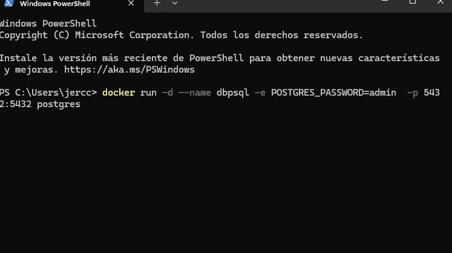
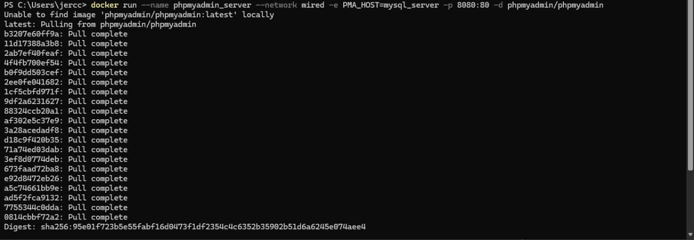

# TENDENCIAS TECNOLOGICAS

## 1. Titulo
TAS9 - Contenedor frontend con React 
## 2. Tiempo de duración
El tiempo de duración fue de 8 horas aproximadamente para el desarrollo de la práctica.

## 3. Fundamentos:

En esta práctica se trabajó con la contenerización de aplicaciones, un concepto fundamental en el desarrollo moderno de software. Esta técnica permite empaquetar una aplicación junto con todas sus dependencias en un entorno portátil y reproducible, conocido como contenedor. Para ello, se utilizó Docker, una de las herramientas más populares en esta área.

El propósito principal fue contenerizar dos componentes clave de una aplicación web: el frontend desarrollado con React y un backend basado en una API REST. Ambos se configuraron para comunicarse a través de una red creada con Docker Compose, lo que permitió simular un entorno de despliegue real en múltiples contenedores que trabajan en conjunto.

React: React es una biblioteca de JavaScript ampliamente utilizada para crear interfaces de usuario interactivas. En esta práctica, se empleó para visualizar información en una tabla, datos que son obtenidos dinámicamente desde la API del backend.

Backend con API REST: UReact es una biblioteca de JavaScript ampliamente utilizada para crear interfaces de usuario interactivas. En esta práctica, se empleó para visualizar información en una tabla, datos que son obtenidos dinámicamente desde la API del backend.

Docker facilita la creación, prueba y despliegue de aplicaciones mediante contenedores. Estos contenedores encapsulan todo lo necesario para ejecutar una aplicación (código, dependencias y configuraciones), garantizando que funcione correctamente sin importar el sistema operativo o entorno donde se ejecute y para gestionar ambos contenedores (frontend y backend), se utilizó Docker Compose. Esta herramienta permite definir y levantar múltiples servicios con un solo comando, mediante un archivo docker-compose.yml, asegurando que los contenedores estén conectados entre sí a través de una red interna.

Esta práctica se centró en dos enfoques principales:

- Desarrollo y prueba local de una aplicación web divida en frontend y backend.

- Contenerización y orquestación de los servicios para simular un entorno real de despliegue.

El objetivo final fue comprender cómo se integran tecnologías modernas como React, APIs REST y Docker en el desarrollo de aplicaciones modulares, portables y escalables.

## 4. Conocimientos previos.

Para realizar esta practica el estudiante necesita tener claro los siguientes temas:
- Manejo de comandos básicos en sistemas operativos basados en Linux (como cd, mkdir, ls, touch, entre otros).

- Navegación y uso de un navegador web para pruebas e interacción con aplicaciones.

Fundamentos de React, incluyendo el uso de componentes, propiedades (props) y hooks.

Comprensión básica del funcionamiento de APIs REST y de las peticiones HTTP, especialmente el método GET.

Uso de la interfaz de línea de comandos de Docker (Docker CLI) y conocimientos sobre Docker Compose.

Conocimiento en la creación y configuración de archivos Dockerfile y docker-compose.yml.

## 5. Objetivos a alcanzar

- Implementar contenedores con React y Node.js usando Docker.
- Manipular archivos de configuración Docker (Dockerfile, docker-compose.yml).
- Mostrar una tabla en React que consuma datos desde una API REST alojada en otro contenedor.
- Asegurar la comunicación entre contenedores mediante red Docker.

## 6. Equipo necesario:

- Computador con sistema operativo Windows/Linux/Mac 
- Cuenta en docker play o  Docekr Hub
- Docker y terminal
-Navegador web (Chrome, Firefox)
- Editor de código (Visual Studio Code)
- Conexión a internet

## 7. Material de apoyo.

- Documentacion oficial de docker.
- Cheat Sheet de comandos Linux
- Documentación de React
- Postman para probar API
- Guía de la asignatura.

## 8. Procedimiento

## Parte 1:  Contenerizar aplicación Frontend con React y mostrar datos desde API. 
### Requisito 1:La tabla deberá visualizar los datos devueltos por una API REST (contenedor backend).
- Crear el archivo index.js que contenga una API básica para devolver una lista de destinos turísticos.
- Generar el archivo package.json.
- Instalar las dependencias necesarias: express y cors.

### Requisito 2: Cada estudiante deberá implementar una tabla diferente, correspondiente a una entidad del proyecto de titulación o del proyecto Piensa.

Crear Dockerfiles para frontend y backend
Crear un archivo Dockerfile para el backend con Express.
Crear un archivo Dockerfile para el frontend con React.

### Requisito 3: Para cumplir con esto, el estudiante debe construir un nuevo proyecto backend y frontend que refleje la información de su entidad específica.

....

### Requisito 4: Ambos proyectos deben ser contenerizados utilizando Docker y comunicarse correctamente (además de los contenedores de la base).

....

## 9. Resultados esperados:

- ...
- ....
- ...

## 10. Bibliografía

- Docker Inc. (2024). Docker Documentation. Recuperado de: https://docs.docker.com

- React Team. (2024). React Official Documentation. Recuperado de: https://react.dev

- W3Schools. (2024). REST API Tutorial. Recuperado de: https://www.w3schools.com

- phpMyAdmin. (2024). phpMyAdmin Documentation. Recuperado de: https://docs.phpmyadmin.net/ 

- Nickoloff, J., & Kuenzli, S. (2019). Docker in Action. Simon and Schuster.

- Miell, I., & Sayers, A. (2019). Docker in Practice. Simon and Schuster.

